# 🧠 Unizumi - Trivia App

Aplicación móvil desarrollada en **Flutter** que ofrece una experiencia de trivia interactiva con preguntas de ciencia, cultura general, geografía, videojuegos y películas. ¡Pon a prueba tus conocimientos en un formato de quiz divertido y educativo!

<br>

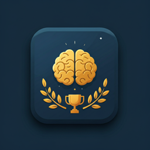

<br><br>

</div>

---

## 👨‍💻 Autores

- Marcos Vallejo
- Cecilia Casas
- Joshua Murillo

---

## 📌 Descripción

**Unizumi** es una aplicación móvil de trivia que:

- Ofrece 50 preguntas por categoría (ciencia, cultura general, geografía, videojuegos, películas).
- Incluye decripción detalladas y recomendaciones de estudio para cada respuesta.
- Presenta un diseño intuitivo y moderno basado en Material Design 3.
- Implementa animaciones suaves, efectos visuales (glow, glass morphism) y retroalimentación inmediata.
- Permite seleccionar categorías, elegir entre 3 modos de juego (rápido, normal, mixto) y responder preguntas de manera interactiva.
- Rastrea estadísticas detalladas: puntuación, tiempo de respuesta promedio, respuestas correctas/incorrectas.
- Incluye un sistema de ranking (leaderboard) para competencia entre jugadores.

Proyecto desarrollado como aplicación de entretenimiento educativo con arquitectura modular y escalable.

---

## 🛠 Tecnologías Utilizadas

### 📱 Desarrollo

- Flutter SDK (3.x)
- Dart (3.x)
- Arquitectura modular por capas

### 🎮 Funcionalidad

- Gestión de preguntas y respuestas
- Navegación entre categorías
- Animaciones y transiciones
- Estado de puntuación y progreso

### 🎨 Diseño

- Material Design
- Google Fonts
- Assets personalizados
- Componentes reutilizables

### 🔧 Control de Versiones

- Git
- GitHub

---

## 📂 Estructura del Proyecto (lib/)

```bash
lib/
├── main.dart                          # Punto de entrada de la aplicación
├── app.dart                           # Configuración de rutas y tema global
│
├── core/
│   ├── constants/
│   │   ├── app_colors.dart           # Paleta de colores (glow effects, neutral colors)
│   │   ├── app_durations.dart        # Duraciones por modo de juego
│   │   ├── app_radius.dart           # Radios de bordes standarizados
│   │   └── app_spacing.dart          # Espaciado consistente en la app
│   ├── theme/
│   │   ├── app_text_styles.dart      # Estilos de texto (display, titles, body)
│   │   └── app_theme.dart            # Tema oscuro global con Material 3
│   └── utils/
│       ├── formatters.dart           # Formateadores de datos (porcentajes, tiempo)
│       └── quiz_helpers.dart         # Utilidades quiz (shuffle, mensajes de desempeño)
│
├── data/
│   ├── models/
│   │   ├── category_model.dart       # Modelo de categoría (id, nombre, descripción, ícono, color)
│   │   ├── game_mode.dart            # Enum de modos: rápido (8s), normal (15s), mixto
│   │   ├── leaderboard_user_model.dart  # Modelo de usuario en ranking
│   │   ├── question_model.dart       # Modelo de pregunta (enunciado, opciones, respuesta, explicación, dificultad)
│   │   └── quiz_result_model.dart    # Modelo de resultado (puntuación, estadísticas, recomendaciones)
│   ├── question_bank/
│   │   ├── ciencia_questions.dart          # 50 preguntas de ciencia
│   │   ├── cultura_general_questions.dart  # 50 preguntas de cultura general
│   │   ├── geografia_questions.dart        # 50 preguntas de geografía
│   │   ├── peliculas_questions.dart        # 50 preguntas de películas
│   │   └── videojuegos_questions.dart      # 50 preguntas de videojuegos
│   └── repositories/
│       ├── leaderboard_repository.dart    # Gestión de datos del ranking (almacenamiento local)
│       └── question_repository.dart       # Acceso centralizado a todas las preguntas por categoría
│
├── features/
│   ├── home/
│   │   └── presentation/
│   │       └── welcome_screen.dart        # Pantalla de bienvenida con introducción a la app
│   │
│   ├── leaderboard/
│   │   └── presentation/
│   │       ├── leaderboard_screen.dart    # Pantalla principal del ranking
│   │       └── widgets/
│   │           ├── leaderboard_tile.dart  # Elemento individual en el ranking (posición, nombre, puntos)
│   │           └── podium_card.dart       # Tarjeta del podio (top 3 jugadores con animaciones)
│   │
│   ├── quiz/
│   │   ├── domain/
│   │   │   └── quiz_controller.dart       # Lógica de control del quiz (estado, temporizador, validación)
│   │   └── presentation/
│   │       ├── quiz_screen.dart           # Pantalla principal del quiz (orquesta componentes)
│   │       └── widgets/
│   │           ├── answer_button.dart     # Botón de respuesta con efectos visuales
│   │           ├── feedback_banner.dart   # Banner de retroalimentación (correcto/incorrecto/tiempo agotado)
│   │           ├── progress_section.dart  # Barra de progreso del quiz
│   │           ├── question_card.dart     # Tarjeta con enunciado de la pregunta
│   │           ├── quiz_top_bar.dart      # Barra superior (categoría, modo, puntuación)
│   │           └── timer_ring.dart        # Temporizador circular animado
│   │
│   ├── results/
│   │   └── presentation/
│   │       ├── results_screen.dart        # Pantalla de resultados post-quiz
│   │       └── widgets/
│   │           ├── result_actions.dart    # Botones de acción (reintentar, menú principal)
│   │           ├── score_hero.dart        # Animación hero de la puntuación obtenida
│   │           └── stats_row.dart         # Fila de estadísticas (correctas/incorrectas/sin responder)
│   │
│   ├── setup/
│   │   └── presentation/
│   │       ├── setup_screen.dart          # Pantalla de configuración (seleccionar categoría y modo)
│   │       └── widgets/
│   │           ├── category_card.dart     # Tarjeta de categoría con ícono y descripción
│   │           ├── continue_button.dart   # Botón continuar (habilitado cuando hay selección)
│   │           └── game_mode_chip.dart    # Chip con opciones de modo de juego
│   │
│   └── splash/
│       └── presentation/
│           └── splash_screen.dart         # Pantalla de carga inicial (logo y animación)
│
└── shared/
    └── widgets/
        ├── animated_page.dart      # Widget de transición de página animada
        ├── app_scaffold.dart       # Estructura base reutilizable (padding, fondo, SafeArea)
        ├── glass_card.dart         # Tarjeta con efecto glass morphism
        ├── glow_button.dart        # Botón con efecto glow dinámico
        ├── gradient_background.dart # Fondo con gradiente configurable
        └── section_title.dart      # Título de sección reutilizable
```

## 📄 Descripción Detallada de las Secciones

### 🔧 Core

Esta carpeta contiene la lógica central y configuraciones compartidas de la aplicación.

#### constants/

- **`app_colors.dart`**: Paleta de colores centralizada incluyendo:
  - Colores neutrales (background oscuro, surface, white)
  - Colores de glow para cada categoría (cyan para ciencia, brownish para geografía, etc.)
  - Color de acento dorado y azul primario
  - Color de error para validaciones

- **`app_durations.dart`**: Duraciones de animaciones y tiempos por modo:
  - Modo Rápido: 8 segundos por pregunta
  - Modo Normal: 15 segundos por pregunta
  - Duraciones estándar para transiciones y feedback

- **`app_radius.dart`**: Valores de radio de esquinas estandarizados para consistencia visual

- **`app_spacing.dart`**: Sistema de espaciado consistente (sm, md, lg, xl) para márgenes y padding

#### theme/

- **`app_text_styles.dart`**: Define estilos de texto reutilizables:
  - Display, Headline y Title styles para encabezados
  - Body styles para contenido
  - Label styles para botones e interactivos
  - Todos usan la familia de fuentes 'Inter'

- **`app_theme.dart`**: Configuración del tema global:
  - Tema oscuro con Material Design 3
  - Color scheme personalizado
  - AppBar y componentes con estilo consistente
  - Background con color oscuro (`AppColors.backgroundDark`)

#### utils/

- **`formatters.dart`**: Funciones reutilizables para formatear datos:
  - Formateo de porcentajes
  - Conversión de tiempos
  - Formateo de puntuaciones

- **`quiz_helpers.dart`**: Utilidades específicas del quiz:
  - `shuffledQuestions()`: Mezcla aleatoria de preguntas
  - `shuffledOptions()`: Mezcla aleatoria de opciones de respuesta
  - `performanceMessage()`: Genera mensajes motivacionales basados en porcentaje (Excelente, Muy buen desempeño, etc.)

### 📊 Data

Maneja todos los datos y modelos de la aplicación, siguiendo el patrón Repository para acceso centralizado.

#### models/

- **`category_model.dart`**: Inmutable modelo de categoría:
  - `id`: Identificador único (ciencia, geografia, etc.)
  - `name`: Nombre visible (Ciencia, Geografía, etc.)
  - `description`: Descripción corta para UI
  - `icon`: IconData de Flutter para renderizar en UI
  - `accentColor`: Color único por categoría para efectos visuales

- **`game_mode.dart`**: Enum con tres modos de juego:
  - `rapido`: 8 segundos por pregunta, descripción "Menos tiempo por pregunta"
  - `normal`: 15 segundos por pregunta, descripción "Ritmo equilibrado"
  - `social`: Todas las categorías, descripción "Todas las categorías en una partida" (mode mixto)
  - Extension `GameModeX` para acceder a propiedades dinámicas

- **`leaderboard_user_model.dart`**: Modelo de usuario para rankings:
  - Almacena datos de puntuación y posición
  - Facilita la visualización en leaderboard (actualmente comentado en rutas)

- **`question_model.dart`**: Modelo completo de pregunta:
  - `id`: Identificador único
  - `categoryId`: Relación con la categoría
  - `question`: Enunciado de la pregunta
  - `options`: Lista de 4 opciones de respuesta
  - `correctAnswer`: Respuesta correcta
  - `explanation`: Explicación detallada de por qué es correcta
  - `difficulty`: Nivel de dificultad
  - Método `isCorrect()`: Valida respuesta usuario
  - Método `copyWith()`: Permite crear copias modificadas

- **`quiz_result_model.dart`**: Modelo de resultado completo:
  - `category` y `mode`: Contexto del quiz
  - `totalQuestions`, `correctAnswers`, `incorrectAnswers`, `unansweredAnswers`: Estadísticas
  - `score`: Puntuación bruta
  - `percentage`: Porcentaje de acierto
  - `averageResponseTime`: Tiempo promedio de respuesta
  - `performanceMessage`: Mensaje motivacional generado
  - `studyRecommendation`: Recomendación de estudio personalizada

#### question_bank/

Contiene 5 archivos con 50 preguntas cada uno:

- **`ciencia_questions.dart`**: Preguntas de física, química, biología, astronomía
- **`cultura_general_questions.dart`**: Preguntas diversas de historia, arte, conocimientos generales
- **`geografia_questions.dart`**: Preguntas de países, capitales, mapas, cultura mundial
- **`peliculas_questions.dart`**: Preguntas de cine, actores, directores, películas famosas
- **`videojuegos_questions.dart`**: Preguntas de juegos populares, géneros, desarrolladoras

Cada pregunta incluye 4 opciones, respuesta correcta, explicación detallada y dificultad.

#### repositories/

- **`question_repository.dart`**: Repositorio central de acceso a datos:
  - `getCategories()`: Retorna lista de 5 categorías disponibles con sus colores y íconos
  - `getQuestionsByCategory()`: Obtiene todas las preguntas de una categoría
  - `getMixedQuestions()`: Retorna preguntas mezcladas de todas las categorías (para modo social/mixto)
  - Implementa patrón Repository para abstracción de datos

- **`leaderboard_repository.dart`**: Gestión persistente del ranking:
  - Almacena y recupera datos del leaderboard
  - Facilita consultas de top jugadores
  - (Actualmente comentado hasta implementar persistencia real)

### 🎮 Features

Organiza las funcionalidades principales de la app por características, siguiendo una arquitectura de capas (domain/presentation) para separación de responsabilidades.

#### home/ - Pantalla de Bienvenida

- **`welcome_screen.dart`**:
  - Primera pantalla después del splash
  - Introducción a la aplicación
  - Botón para navegar a SetupScreen
  - Establece el contexto y tono de la app

#### leaderboard/ - Sistema de Rankings

- **`leaderboard_screen.dart`**: Pantalla principal del ranking:
  - Muestra lista ordenada de jugadores
  - Destaca top 3 con podio personalizado
  - Integración con podium_card y leaderboard_tile
  - (Actualmente comentado en rutas hasta persistencia real)

- **Widgets**:
  - **`leaderboard_tile.dart`**: Elemento individual del ranking:
    - Posición (número ordinal)
    - Nombre del jugador
    - Puntuación
    - Efecto visual para destacar top 3
  - **`podium_card.dart`**: Tarjeta especial del podio:
    - Diseño visual para las 3 primeras posiciones
    - Animaciones hero para énfasis
    - Colores diferenciados (oro, plata, bronce)
    - Tamaños escalonados según posición

#### quiz/ - Núcleo del Juego de Trivia

- **Domain (Lógica de Negocio)**:
  - **`quiz_controller.dart`**: ChangeNotifier que controla toda la lógica del quiz:
    - Gestión de preguntas y opciones actuales
    - Temporizador con duración según GameMode
    - Validación de respuestas y cálculo de puntuación
    - Contador de aciertos/fallos/sin responder
    - Genera QuizResultModel con estadísticas completas
    - Manejo de navegación automática a ResultsScreen

- **Presentation (UI)**:
  - **`quiz_screen.dart`**: Pantalla principal del quiz:
    - Recibe CategoryModel y GameMode desde SetupScreen
    - Inicializa QuizController con preguntas
    - Orquesta componentes: QuizTopBar, QuestionCard, AnswerButtons, TimerRing, FeedbackBanner
    - Maneja ciclo de vida, transiciones de preguntas y navegación a ResultsScreen

  - **Widgets interactivos**:
    - **`answer_button.dart`**: Botón de respuesta:
      - Estados visuales: normal, seleccionado, correcto, incorrecto
      - Efectos glow personalizados
      - Deshabilitado durante feedback
      - Animación de selección
    - **`feedback_banner.dart`**: Banner de retroalimentación:
      - Aparece después de seleccionar respuesta
      - Muestra: ✓ para acierto, ✗ para fallo, ⏱ para tiempo agotado
      - Desliza automáticamente a siguiente pregunta
      - Almacena feedback brevemente
    - **`progress_section.dart`**: Barra de progreso:
      - Muestra pregunta actual vs total
      - Indicador visual de avance (ej: 5/10)
      - Anímación fluida
    - **`question_card.dart`**: Tarjeta de pregunta:
      - Enunciado centrado y legible
      - Efecto glass morphism
      - Animación de entrada
      - Tamaño responsive
    - **`quiz_top_bar.dart`**: Barra superior:
      - Muestra categoría seleccionada
      - Muestra modo de juego
      - Puede incluir botón atrás
    - **`timer_ring.dart`**: Temporizador circular:
      - Anillo que se vacía progresivamente
      - Color cambia según tiempo restante (verde → amarillo → rojo)
      - Emite sonido/vibración al acabarse tiempo
      - Actualización cada décima de segundo

#### results/ - Pantalla de Resultados

- **`results_screen.dart`**: Muestra resultados detallados:
  - Recibe QuizResultModel como argumento
  - Anima entrada con transición
  - Orquesta: ScoreHero, StatsRow, ResultActions
  - Opciones para reintentar o ir a menú principal

- **Widgets de resultados**:
  - **`score_hero.dart`**: Animación hero de puntuación:
    - Transición fluida de score
    - Éfasis visualizado grande
    - Counter animado del porcentaje
    - Mensaje de desempeño dinámico
  - **`stats_row.dart`**: Fila de estadísticas:
    - Respuestas correctas (con color verde)
    - Respuestas incorrectas (con color rojo)
    - Respuestas sin responder (con color neutral)
    - Tiempo promedio de respuesta
    - Iconos y números legibles
  - **`result_actions.dart`**: Botones de acción:
    - Botón "Reintentar": vuelve a SetupScreen
    - Botón "Menú Principal": vuelve a WelcomeScreen
    - AnimacionesTransiciones suaves

#### setup/ - Configuración del Quiz

- **`setup_screen.dart`**: Pantalla de configuración:
  - Carga 5 categorías desde QuestionRepository
  - Presenta 3 opciones de GameMode
  - Botón Continuar habilitado solo cuando hay selecciones válidas
  - Animaciones de entrada y fade para elementos
  - Navega a QuizScreen con parámetros seleccionados

- **Widgets de configuración**:
  - **`category_card.dart`**: Tarjeta de categoría:
    - Ícono con color acento de la categoría
    - Nombre y descripción
    - Estado seleccionado/no seleccionado
    - Efecto glow al seleccionar
    - Tap para alternar selección
  - **`game_mode_chip.dart`**: Chip de modo de juego:
    - Tres opciones: Rápido/Normal/Mixto
    - Estado seleccionado destacado
    - Mostrar duración de tiempo y descripción
    - Tap para cambiar selección
  - **`continue_button.dart`**: Botón continuar:
    - Deshabilitado si no hay categoría/modo seleccionado
    - Animación de estado habilitado/deshabilitado
    - Navega a QuizScreen al presionar
    - Pasa CategoryModel y GameMode como argumentos

#### splash/ - Pantalla de Carga

- **`splash_screen.dart`**:
  - Primera pantalla al abrir app
  - Muestra logo y animación de carga
  - Transición automática a WelcomeScreen
  - Duración: 2-3 segundos antes de navegar
  - Pantalla completa con degradado de fondo

### 🎨 Shared

Componentes y widgets reutilizables en múltiples pantallas, garantizando consistencia visual y funcional.

#### widgets/ - Componentes Reutilizables

- **`animated_page.dart`**: Widget de transición animada:
  - Envuelve pantallas para animaciones de entrada/salida
  - Soporta animaciones de slide, fade, scale
  - Duración configurable
  - Mejora experiencia de navegación

- **`app_scaffold.dart`**: Estructura base reutilizable:
  - Proporciona padding consistente
  - Fondo con gradiente integrado
  - Opción SafeArea para notches y barras del sistema
  - Evita código repetitivo en cada pantalla
  - Configuración centralizada de márgenes

- **`glass_card.dart`**: Tarjeta con efecto glass morphism:
  - Fondo semi-transparente blurrado
  - Borde sutil con efecto cristal
  - Efecto visual moderno y atractivo
  - Usado en preguntas, resultados y títulos
  - Sombra suave para profundidad

- **`glow_button.dart`**: Botón con efecto glow dinámico:
  - Resplandor de color según contexto
  - Efecto hover mejorado
  - Shadow dinámico que responde a interacción
  - Usado en botones de respuesta y acciones principales
  - Estados visuales claros (normal, pressed, disabled)

- **`gradient_background.dart`**: Fondo con gradiente:
  - Gradiente personalizable (color inicial, color final)
  - Aplicable a toda la pantalla o secciones
  - Mejora atractivo visual
  - Usado como fondo en AppScaffold
  - Animación opcional de gradiente

- **`section_title.dart`**: Título de sección reutilizable:
  - Tamaño y estilo consistente
  - Opcional ícono a lado del título
  - Padding automático
  - Usado en encabezados de Setup, Leaderboard, etc.

## �📸 Imágenes de la Aplicación

### Icono de la Aplicación

<div align="center">

</div>

### Pantallas Principales

<div align="center">
<table>
<tr>
<td align="center">
<b>Splash/Carga</b><br><br>
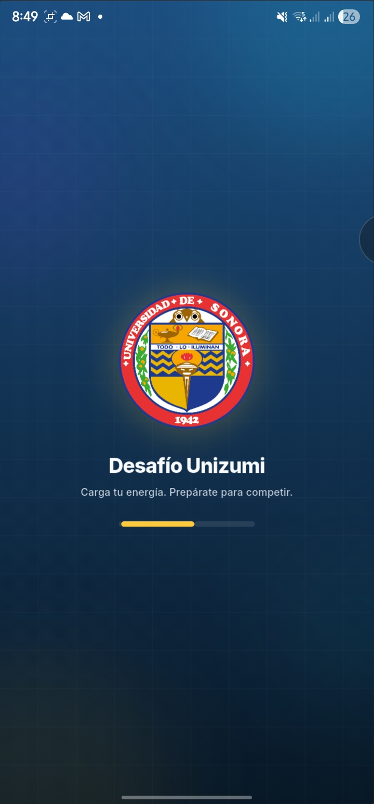
</td>
<td align="center">
<b>Bienvenida</b><br><br>
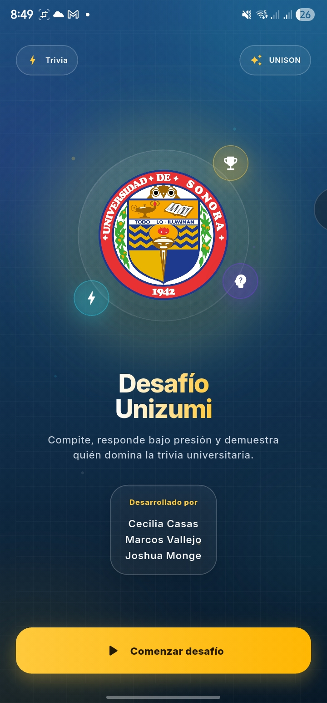
</td>
</tr>
</table>
</div>

### Configuración del Quiz

<div align="center">
<table>
<tr>
<td align="center">
<b>Selección de Categorías</b><br><br>
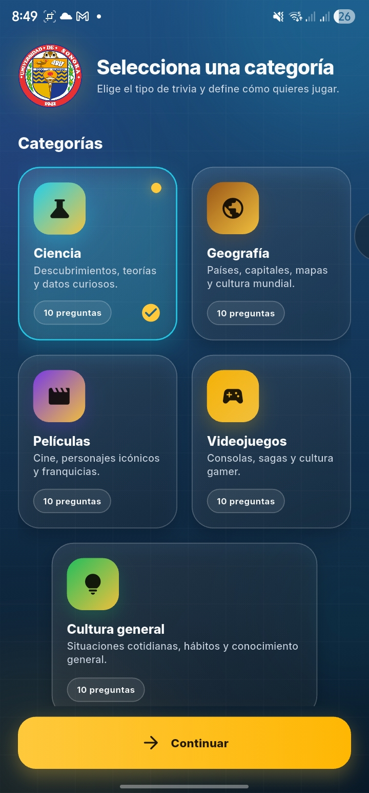
</td>
<td align="center">
<b>Categoría Seleccionada</b><br><br>
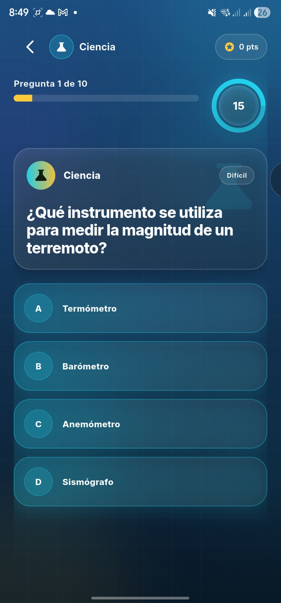
</td>
</tr>
<td align="center">
<b>Selección de Categorías</b><br><br>
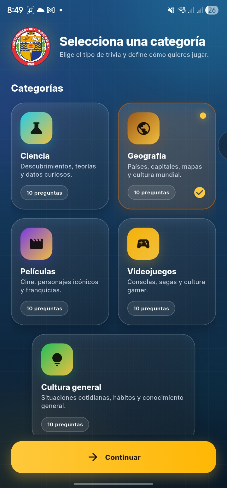
</td>
<td align="center">
<b>Categoría Seleccionada</b><br><br>
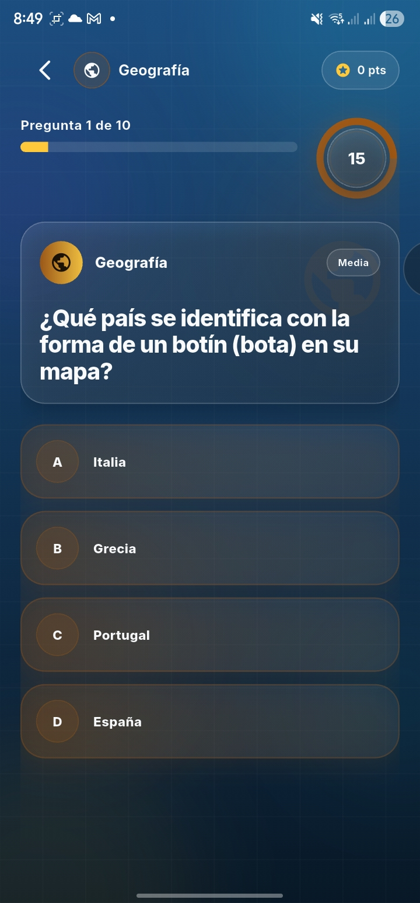
</td>
</tr><td align="center">
<b>Selección de Categorías</b><br><br>
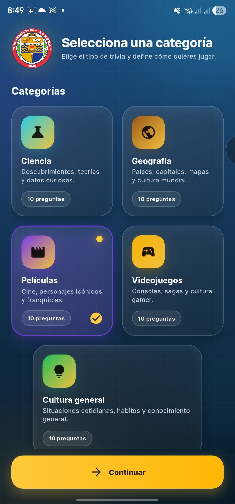
</td>
<td align="center">
<b>Categoría Seleccionada</b><br><br>
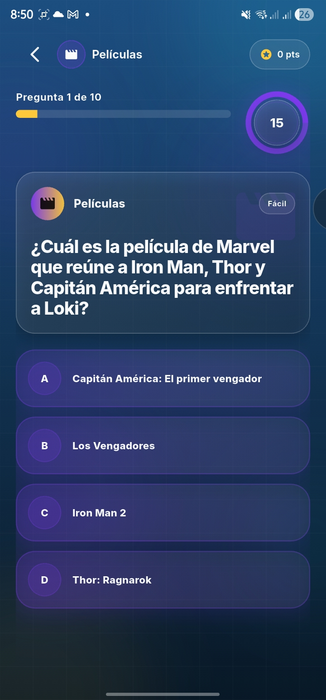
</td>
</tr><td align="center">
<b>Selección de Categorías</b><br><br>
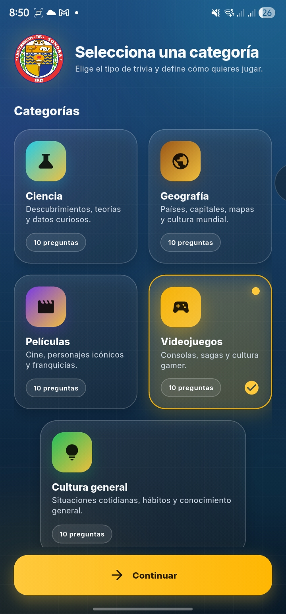
</td>
<td align="center">
<b>Categoría Seleccionada</b><br><br>
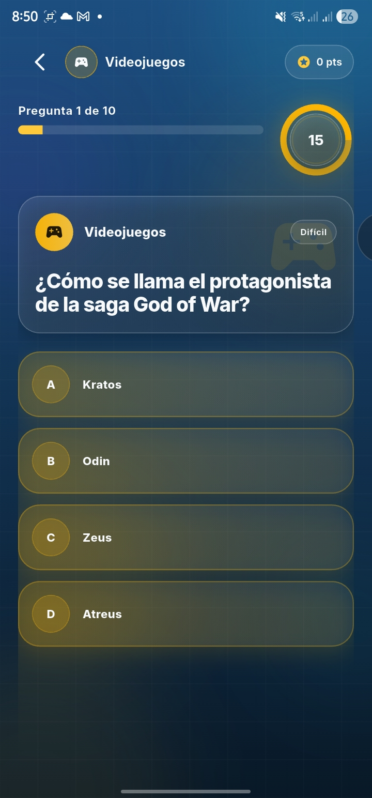
</td>
</tr><td align="center">
<b>Selección de Categorías</b><br><br>
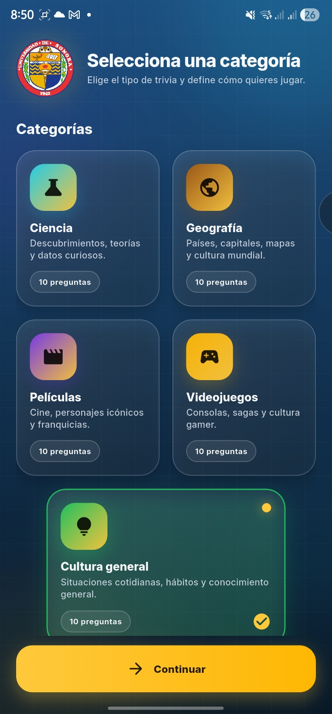
</td>
<td align="center">
<b>Categoría Seleccionada</b><br><br>
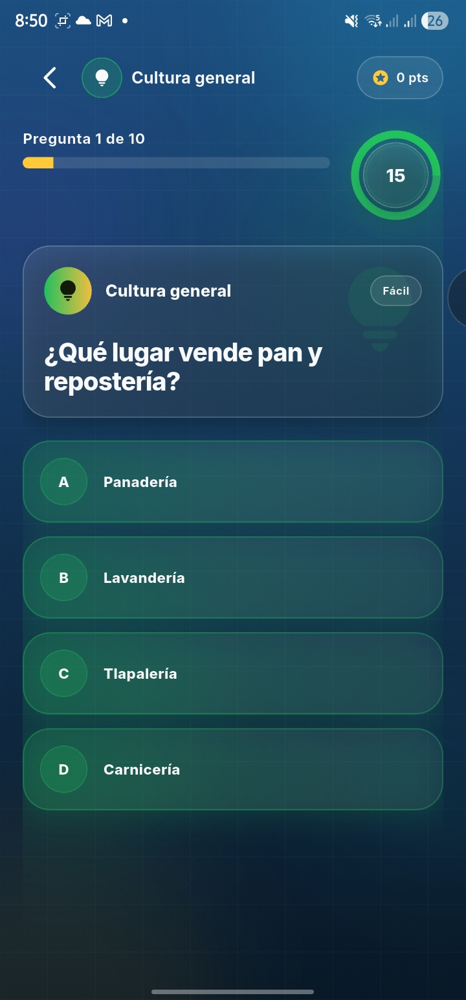
</td>
<tr>
<td align="center">
<b>Selección de Modo de Juego</b><br><br>
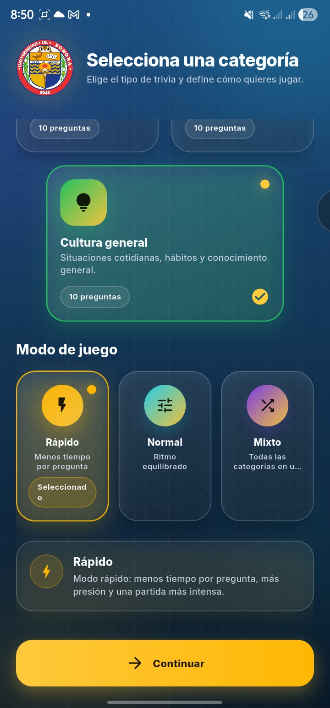
</td>
<td align="center">
<b>Modo Seleccionado</b><br><br>
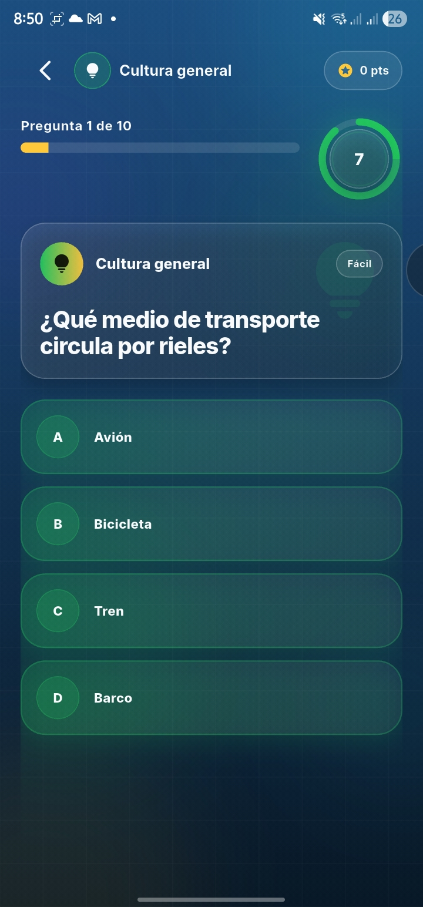
</td>
</tr>
<td align="center">
<b>Selección de Modo de Juego</b><br><br>
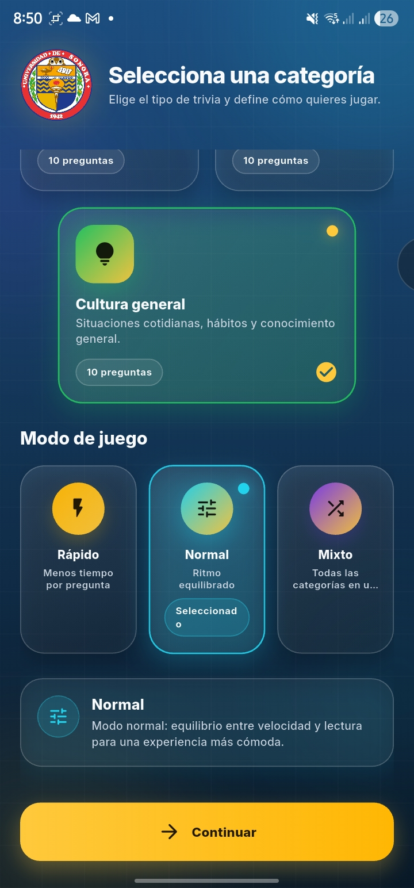
</td>
<td align="center">
<b>Modo Seleccionado</b><br><br>

</td>
</tr>
<td align="center">
<b>Selección de Modo de Juego</b><br><br>
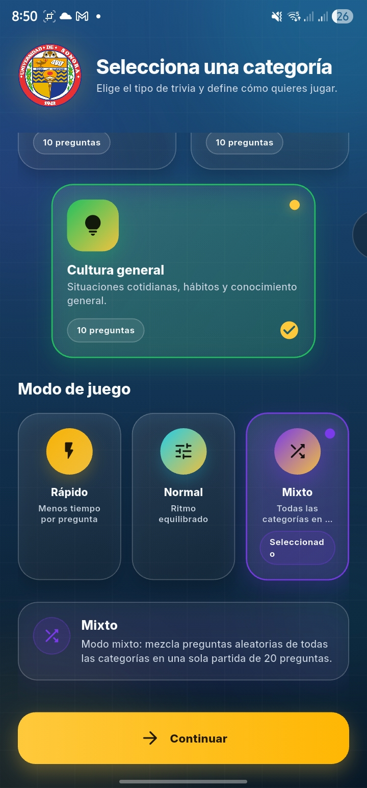
</td>
<td align="center">
<b>Modo Seleccionado</b><br><br>
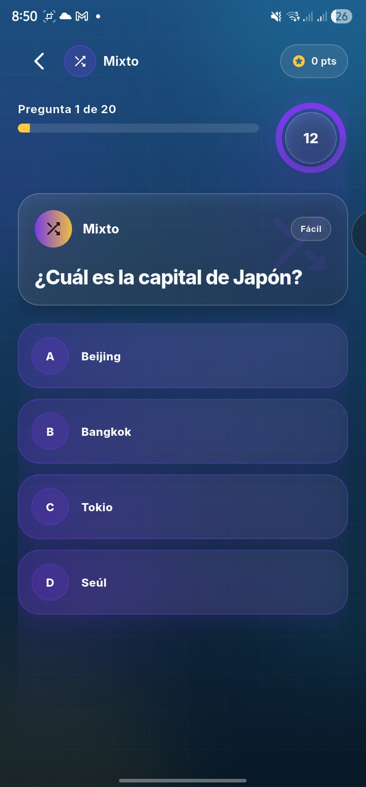
</td>
</tr>
</table>
</div>

### Pantalla de Quiz

<div align="center">
<table>
<tr>
<td align="center">
<b>Pregunta de Trivia</b><br><br>
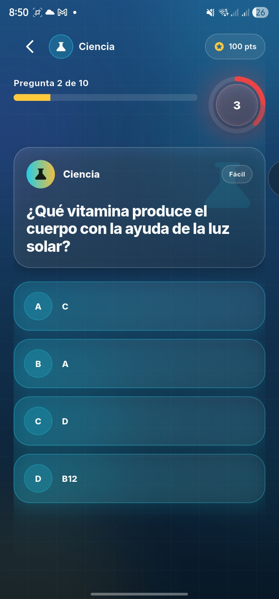
</td>
<td align="center">
<b>Respuesta Correcta</b><br><br>
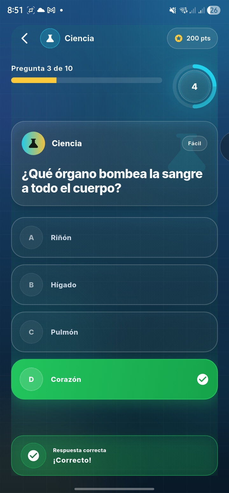
</td>
</tr>
<tr>
<td align="center">
<b>Respuesta Incorrecta</b><br><br>
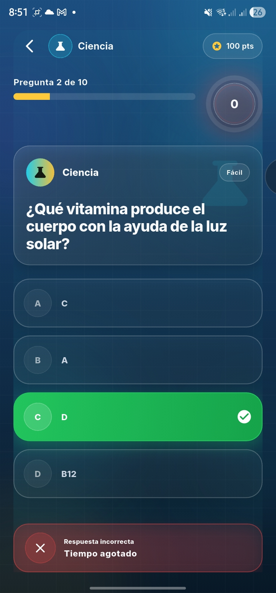
</td>
<td align="center">
<b>Feedback de Error</b><br><br>
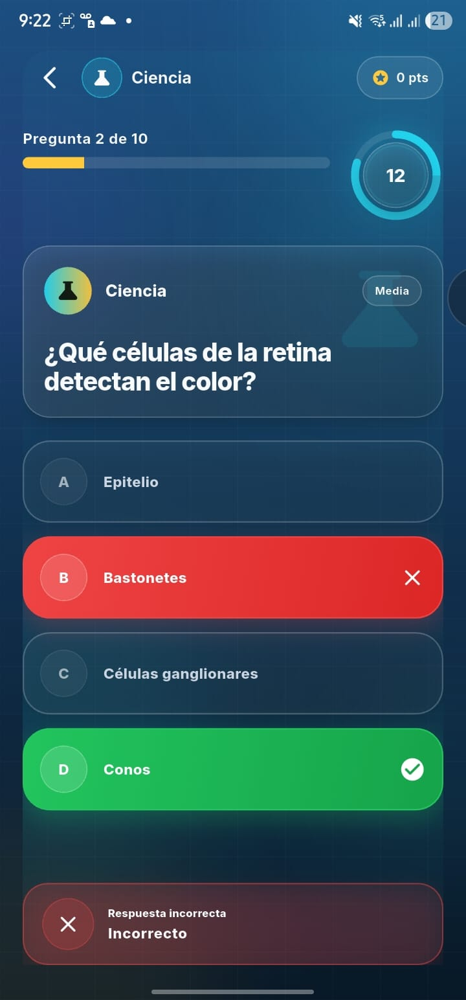
</td>
</tr>
</table>
</div>

### Resultados

<div align="center">
<table>
<tr>
<td align="center">
<b>Pantalla de Resultados</b><br><br>
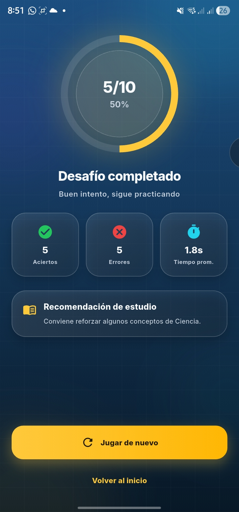
</td>
</tr>
</table>
</div>

## 📦 Release 1.0

La versión estable se encuentra en:

Releases → v1.0

Incluye:

- APK instalable para Android
- Compilación en modo release

### Generar APK

```bash
flutter build apk --release
```

Ubicación del archivo generado:

```
build/app/outputs/flutter-apk/app-release.apk
```

## 🚀 Cómo Ejecutar el Proyecto

```bash
flutter clean
flutter pub get
flutter run
```
